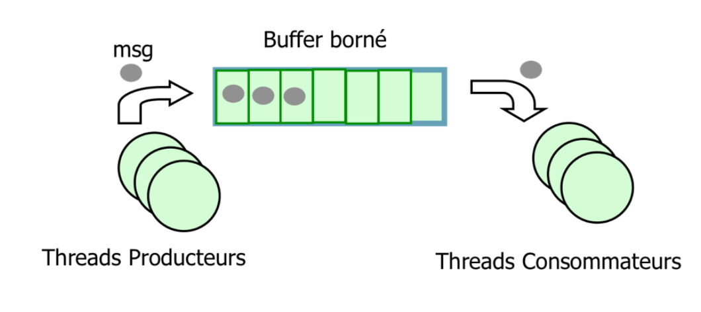

# PostCond

## **Objectif 1 — Solution directe**

| **Opération**        | **Pré-action**                              | **Garde (condition)**        	       | **Post-action**                                          |
|------------------------|-------------------------------------------|-----------------------------------------|----------------------------------------------------------|
| **Produce(Message m)** | Insertion d’un message par un *Producer*  | `nfull < bufSize` *(buffer non plein)*  | `nempty--` ; `nfull++` ;  |
| **Consume()**          | Retrait d’un message par un *Consumer*    | `nfull > 0` *(buffer non vide)*         | `nfull--` ; `nempty++` ;      |

---

## **Objectif 2 — Terminaison**

---

## **Objectif 3 — Terminaison**

---

## **Objectif 4 — Terminaison**

---

## **Objectif 5 — Terminaison**

---

## **Objectif 6 — Terminaison**