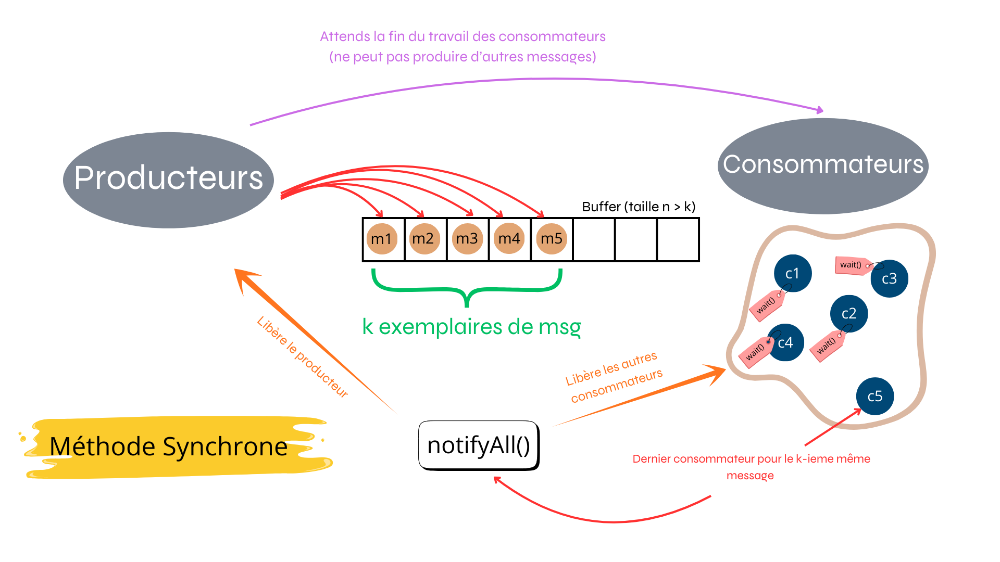

# PostCond

## **Objectif 1 — Solution directe**

| **Opération**        | **Pré-action**                              | **Garde (condition)**        	       | **Post-action**                                          |
|------------------------|-------------------------------------------|-----------------------------------------|----------------------------------------------------------|
| **Produce(Message m)** | Insertion d’un message par un *Producer*  | `nfull < bufSize` *(buffer non plein)*  | `nempty--` ; `nfull++` ;  |
| **Consume()**          | Retrait d’un message par un *Consumer*    | `nfull > 0` *(buffer non vide)*         | `nfull--` ; `nempty++` ;      |

---

## **Objectif 2 — Terminaison**

Extension de l'objectif 1 pour permettre la terminaison des producteurs et consommateurs.
    
---

## **Objectif 3 — Sémaphores**

Cette fois ci , on utilise des sémaphores pour gérer les ressources partagées.

---

## **Objectif 4 — Moniteurs (avec ReentrantLock et Condition)**

Nous avons utilisé les méthodes `await()` et `signal()` de l'interface `Condition`

Ceci est équivalent à l'utilisation de `wait()` et `notify()` des moniteurs Java classiques.
Nous avons également utilisé `lock()` et `unlock()` de l'interface `Lock` pour gérer les sections critiques.

---

## **Objectif 5 — Multi-consommation**

.png>)

---

## **Objectif 6 — Multi-exemplaires synchrone**!

